<a href="https://portefolio-ms.vercel.app">
<picture>
  <source media="(prefers-color-scheme: dark)" srcset="assets/banner-dark.svg"/>
  <source media="(prefers-color-scheme: light)" srcset="assets/banner-light.svg"/>
  
</picture>
</a>

### Software engineering across applications, data and AI — from business workflows to production services.

  

 

  <picture>
    <source media="(prefers-color-scheme: dark)" srcset="https://capsule-render.vercel.app/api?type=waving&height=220&section=header&text=Moussa%20SOW&fontSize=52&fontColor=ffffff&animation=fadeIn&fontAlignY=38&desc=Software%20Engineering%20%7C%20Information%20Systems%20%7C%20Data%20%7C%20AI&descAlignY=58&descSize=18">
    <source media="(prefers-color-scheme: light)" srcset="https://capsule-render.vercel.app/api?type=waving&height=220&section=header&text=Moussa%20SOW&fontSize=52&fontColor=ffffff&animation=fadeIn&fontAlignY=38&desc=Software%20Engineering%20%7C%20Information%20Systems%20%7C%20Data%20%7C%20AI&descAlignY=58&descSize=18">
    
  </picture>

  

  
  

---

## About

I build software systems where **applications, data and machine learning meet real operational workflows**.

My focus is the engineering around these systems: **architecture, APIs, data workflows, evaluation, deployment, monitoring and traceability**.

My direction sits at the intersection of **software engineering, information systems, data and applied AI**.

---

## Current focus

<table>
<tr>
<td width="33%" align="center">

### Building

**CIF**

Credit-risk engineering and decision-support systems moving toward real-data validation.

</td>
<td width="33%" align="center">

### Deepening

**Software Architecture**

Designing systems that remain maintainable, testable and deployable.

</td>
<td width="33%" align="center">

### Exploring

**ML Engineering**

Moving from models and experiments toward reliable data and ML systems.

</td>
</tr>
</table>

---

## What I build

<table>
<tr>
<td width="50%" valign="top">

### Software systems

Web applications and APIs designed around concrete workflows, with an emphasis on maintainability, integration and reliable services.

**Focus**

`Architecture` · `APIs` · `Web` · `Integration`

</td>
<td width="50%" valign="top">

### Data & ML systems

Data workflows and machine learning systems covering preparation, modelling, evaluation, reproducibility and serving.

**Focus**

`Data` · `ML` · `Evaluation` · `Serving`

</td>
</tr>

<tr>
<td width="50%" valign="top">

### Decision-support systems

Systems that turn predictive outputs into operational decisions through explicit policies, explanations, thresholds and human review.

**Focus**

`Risk` · `Decisioning` · `Explainability` · `Governance`

</td>
<td width="50%" valign="top">

### Integrated services

APIs, databases, authentication and supporting services connected into deployable software systems.

**Focus**

`Backend` · `Databases` · `Security` · `Infrastructure`

</td>
</tr>
</table>

---

## Selected work

### CIF Credit Engine

**Credit-risk ML infrastructure for reproducible workflows, model evaluation, API serving and monitoring.**

* Reproducible data and modelling workflows
* Temporal evaluation and calibration
* XGBoost-based credit-risk modelling
* FastAPI scoring service
* MLflow experiment and model tracking
* PostgreSQL audit records
* Monitoring and CI-based quality checks

 

---

### CIF Credit Platform

**Decision-support application for explainable and auditable credit-risk decisions.**

* Risk scoring and decision engine
* Approval, human review, adjustment and rejection workflows
* Cost-aware decision thresholds
* SHAP-based explanations
* Temporal validation and leakage controls
* Audit and governance mechanisms

 

---

## Engineering stack

  

### Data & Machine Learning

  
  
  
  
  
  
  

### Engineering & Infrastructure

  
  
  
  
  
  

### Exploring

  
  

---

  Software engineering first · Information systems · Data · Applied AI

