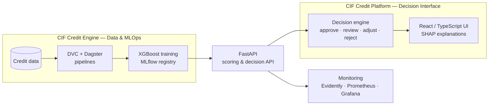

<div align="center">


### Software Engineering · Information Systems · Data & AI

I build software systems and digital products — applications, APIs and data-driven systems<br/>
that are **maintainable, testable and deployable**, extended with machine learning where it creates real value.

<br/>

[](https://portefolio-ms.vercel.app)  
[](https://www.linkedin.com/in/ms-officiel)

<br/>

[](https://cif-credit-intelligence.onrender.com/docs)

<br/>
<br/>

</div>

---

## About Me

```yaml
name: Moussa Sow
located_in: Sénégal
current_focus: Software Engineering · Information Systems · Data & AI
languages: [French, English, Wolof]
```

* Currently building **scalable APIs** and **data-driven applications**
* Deepening **MLOps**, **distributed systems**, and **cloud-native architectures**
* I care about **clean code**, **testing**, **CI/CD**, and **observability**
* Open to **collaborations** on open-source and impactful projects
* Reach me through **[LinkedIn](https://www.linkedin.com/in/ms-officiel)** or **[Portfolio](https://portefolio-ms.vercel.app)**

---

## Tech Stack

<div align="center">

### Languages

 
 
 
 


<br/>

### Backend & APIs

 
 
 


<br/>

### Frontend

 
 


<br/>

### Data & AI

 
 
 
 


<br/>

### Databases

 
 


<br/>

### DevOps & Tools

 
 
 
 


</div>

---

## GitHub Stats

<div align="center">

   

<br/>
<br/>


<br/>
<br/>


</div>

---

## Selected Work

<div align="center">

<a href="https://github.com/Sow221/cif-credit-intelligencedescription">
  
</a>
&nbsp;&nbsp;
<a href="https://github.com/Sow221/cif-credit-intelligence">
  
</a>

</div>

<br/>

### CIF Credit Engine

<sub>Credit-risk ML system · Python · FastAPI · XGBoost · MLflow · DVC · Dagster</sub>

> Open-source credit-risk engineering platform for microfinance institutions — built as a **reproducible ML system**, not a notebook.

* **Data pipelines** — versioned with DVC and orchestrated with Dagster
* **Machine learning** — XGBoost default-probability model tracked in MLflow and documented with model cards
* **API serving** — FastAPI with JWT authentication, rate limiting and a PostgreSQL audit trail
* **Monitoring** — data drift with Evidently, Prometheus and Grafana
* **Engineering** — CI builds and Trivy-scans the Docker image

<br/>

 
 
 
 
 
 
 


<br/>

**[Code](https://github.com/Sow221/cif-credit-intelligencedescription)** · **[Live API docs](https://cif-credit-intelligence.onrender.com/docs)** <sub>Free tier — first request may take a minute</sub>

---

### CIF Credit Platform

<sub>Decision-support application · React · TypeScript · FastAPI · SHAP · Playwright · Storybook</sub>

> Decision-support application for credit officers, turning risk scores into **explainable, auditable lending decisions**.

* **Calibrated scoring** — XGBoost on 25 features, recalibrated with isotonic regression
* **Decision engine** — four outcomes: approve · human review · adjust · reject
* **Explainability** — per-client SHAP contributions exposed through the API
* **Cost-driven thresholds** — balancing review capacity, false positives and false negatives
* **Application layer** — React / TypeScript interface integrated with machine-learning services
* **Quality** — end-to-end testing with Playwright and component documentation with Storybook

<br/>

 
 
 
 
 


<br/>

**[Code](https://github.com/Sow221/cif-credit-intelligence)**

---

## How the CIF System Fits Together



---

## Information Systems

* **Business workflows** — modelling operational processes, decision flows and human-review workflows
* **System integration** — REST APIs, external services, webhooks and application-to-service communication
* **Data & traceability** — versioned data, model lifecycle, audit trails and decision logs
* **Security & access control** — authentication, authorization and role-based permissions
* **Deployment** — containerized services, CI/CD and production-oriented engineering practices

---

## What I'm Working On

* **Software architecture** — designing maintainable systems and application boundaries
* **Machine learning engineering** — building reproducible ML workflows beyond model training
* **Infrastructure & deployment** — deepening MLOps, observability and cloud-native engineering
* **Technical writing** — documenting architecture, engineering decisions and lessons learned

---

## Let's Connect

<div align="center">

[](https://portefolio-ms.vercel.app)  
[](https://www.linkedin.com/in/ms-officiel)

<br/>
<br/>

<sub>Software Engineering · Information Systems · Data & AI</sub>

</div>

<br/>

<div align="center">


</div>
