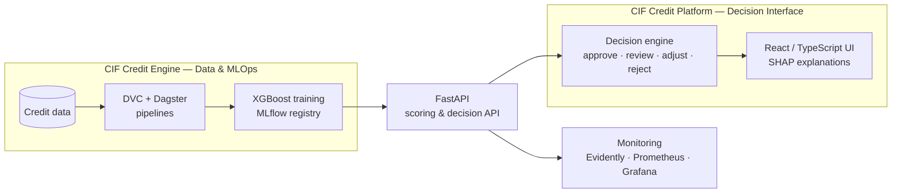

# Moussa Sow

### Software Engineering · Information Systems · Data & AI

I build software systems and digital products — applications, APIs and data-driven systems 
that are **maintainable, testable and deployable**, extended with machine learning where it creates real value.

 

  

 

---

## Selected work

### CIF Credit Engine

Credit-risk ML system · Python · FastAPI · XGBoost · MLflow · DVC · Dagster

> Open-source credit-risk engineering platform for microfinance institutions — built as a **reproducible ML system**, not a notebook.

* **Data pipelines** — versioned with DVC and orchestrated with Dagster
* **Machine learning** — XGBoost default-probability model tracked in MLflow and documented with model cards
* **API serving** — FastAPI with JWT authentication, rate limiting and a PostgreSQL audit trail
* **Monitoring** — data drift with Evidently, Prometheus and Grafana
* **Engineering** — CI builds and Trivy-scans the Docker image

 

 
 
 
 
 
 
 

 

**[Code](ENGINE_REPO_URL)** · **[Live API docs](LIVE_API_URL)** Free tier — first request may take a minute

---

### CIF Credit Platform

Decision-support application · React · TypeScript · FastAPI · SHAP · Playwright · Storybook

> Decision-support application for credit officers, turning risk scores into **explainable, auditable lending decisions**.

* **Calibrated scoring** — XGBoost on 25 features, recalibrated with isotonic regression
* **Decision engine** — four outcomes: approve · human review · adjust · reject
* **Explainability** — per-client SHAP contributions exposed through the API
* **Cost-driven thresholds** — balancing review capacity, false positives and false negatives
* **Application layer** — React / TypeScript interface integrated with machine-learning services
* **Quality** — end-to-end testing with Playwright and component documentation with Storybook

 

 
 
 
 
 

 

**[Code](PLATFORM_REPO_URL)**

---

## How the CIF system fits together

---

## Technical stack

### Languages

 
 
 
 

### Backend & APIs

 
 

### Frontend

 
 
 

### Data & Machine Learning

 
 
 
 

### MLOps & Observability

 
 
 
 

### Databases

 

### Engineering & Infrastructure

 
 
 
 

---

## Information systems

* **Business workflows** — modelling operational processes, decision flows and human-review workflows
* **System integration** — REST APIs, external services, webhooks and application-to-service communication
* **Data & traceability** — versioned data, model lifecycle, audit trails and decision logs
* **Security & access control** — authentication, authorization and role-based permissions
* **Deployment** — containerized services, CI/CD and production-oriented engineering practices

---

## Currently

Deepening software architecture, information systems and machine learning engineering — building reliable software systems where **data and AI create useful capabilities**.
