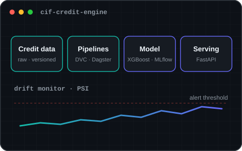
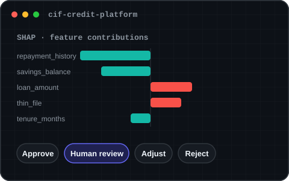
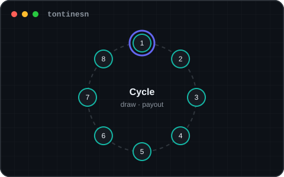
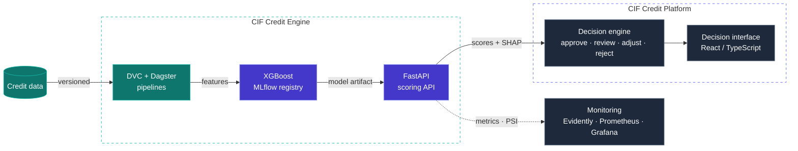

<a href="https://portefolio-ms.vercel.app">
<picture>
  <source media="(prefers-color-scheme: dark)" srcset="assets/banner-dark.svg"/>
  
</picture>
</a>

### Software engineer building credit, fintech and data-driven systems — from interface to ML pipeline.

 

## About

I design and build software where **applications, data and machine learning meet real workflows** — credit decisions, savings groups, payments.
My focus is the engineering around the model: reproducible pipelines, traceable decisions, tested APIs and systems that can be deployed and audited.

 

## 01 · Currently

<table>
<tr>
<td width="7%" align="center" valign="middle"></td>
<td width="18%" valign="middle"><strong>building</strong></td>
<td valign="middle">CIF — moving from synthetic to real-data validation</td>
</tr>
<tr>
<td width="7%" align="center" valign="middle"></td>
<td width="18%" valign="middle"><strong>deepening</strong></td>
<td valign="middle">software architecture · ML engineering</td>
</tr>
<tr>
<td width="7%" align="center" valign="middle"></td>
<td width="18%" valign="middle"><strong>ask me about</strong></td>
<td valign="middle">credit scoring · MLOps · Laravel · FastAPI</td>
</tr>
<tr>
<td width="7%" align="center" valign="middle"></td>
<td width="18%" valign="middle"><strong>open to</strong></td>
<td valign="middle">internships · junior software / ML engineering roles</td>
</tr>
</table>

## 02 · What I build

<table>
<tr>
<td width="33%" valign="top">

**Business applications**

Web apps and APIs for real workflows: tontines, lending, payments

<samp>Laravel · FastAPI · React</samp>

</td>
<td width="33%" valign="top">

**Data &amp; ML pipelines**

Versioned, orchestrated and reproducible from raw data to model

<samp>DVC · Dagster · MLflow</samp>

</td>
<td width="33%" valign="top">

**Decision-support systems**

Calibrated scoring, explanations and human review built in

<samp>XGBoost · SHAP</samp>

</td>
</tr>
<tr>
<td width="33%" valign="top">

**Traceable &amp; secure systems**

Audit trails, access control and multi-tenant isolation

<samp>RBAC · JWT · OTP</samp>

</td>
<td width="33%" valign="top">

**Integrations**

Mobile-money payments, messaging APIs and webhooks

<samp>PayTech · WhatsApp · REST</samp>

</td>
<td width="33%" valign="top">

**Monitoring &amp; delivery**

Drift detection, CI/CD and containerised services

<samp>Prometheus · Grafana · Docker</samp>

</td>
</tr>
</table>

## 03 · Selected projects

<table>
<tr>
<td width="42%" valign="top">

</td>
<td width="4%"></td>
<td width="54%" valign="top">

### [CIF Credit Engine](https://github.com/Sow221/cif-credit-intelligencedescription)

<samp>credit-risk ML system · open source</samp>

> **Problem** — Microfinance lenders hold fragmented data but lack a trustworthy way to turn it into credit decisions.

Credit-risk engineering platform — built as a **reproducible ML system**, not a notebook.

* Data pipelines versioned with **DVC**, orchestrated with **Dagster**
* **XGBoost** model tracked in **MLflow**, documented with model cards
* Method validated on **public Lending Club data** with an **out-of-time evaluation protocol**
* **FastAPI** serving: JWT, Redis rate limiting, PostgreSQL audit trail
* Drift alerts with a from-scratch **PSI**, Evidently, Prometheus, Grafana
* **107 tests** · 74 % coverage · CI with linting, type checking and Docker image scanning

  

 

</td>
</tr>

<tr><td colspan="3"> </td></tr>

<tr>
<td width="42%" valign="top">

</td>
<td width="4%"></td>
<td width="54%" valign="top">

### [CIF Credit Platform](https://github.com/Sow221/cif-credit-intelligence)

<samp>decision-support application</samp>

> **Problem** — A risk score alone does not tell a credit officer what to do — or why.

Turns risk scores into **explainable, auditable lending decisions** for credit officers.

* Four-way **decision engine**: approve · human review · adjust · reject
* **Cost-driven thresholds** balancing review capacity and error costs
* Per-client **SHAP** explanations exposed through the API
* **RBAC**, multi-tenant JWT and append-only audit trail
* Temporal validation, anti-leakage controls and segmented evaluation
* CI with **ruff, mypy, pytest and anti-leakage checks**

</td>
</tr>

<tr><td colspan="3"> </td></tr>

<tr>
<td width="42%" valign="top">

</td>
<td width="4%"></td>
<td width="54%" valign="top">

### TontineSN

<samp>fintech web application · private repository</samp>

> **Problem** — Tontines run on notebooks and group chats — contributions, draws and payouts are hard to track and trust.

Laravel application digitising **tontines** (rotating savings groups) for the Senegalese market.

* Contribution **cycles and draws**, member roles and administration
* **Mobile-money** payment integration, QR flows, receipts and outbound webhooks
* **WhatsApp** notifications and member credit-scoring
* PHPUnit feature tests, **PHPStan** static analysis, CI

Code available on request.

</td>
</tr>
</table>

> [!NOTE]
> The live API runs on a free tier — the first request may take about a minute to wake it up.

## 04 · Architecture

The two CIF repositories form one engineering chain — data to decision:

## 05 · Tech stack

Grouped by how I use them — every <b>primary</b> tool is used in the projects above.

<table>
<tr>
<td width="24%" valign="top"><strong>Primary</strong> <em>used in production-style work</em></td>
<td valign="top">

</td>
</tr>
<tr>
<td width="24%" valign="top"><strong>Data · ML</strong> <em>modelling and pipelines</em></td>
<td valign="top">

</td>
</tr>
<tr>
<td width="24%" valign="top"><strong>Operations</strong> <em>data stores, testing, observability</em></td>
<td valign="top">

</td>
</tr>
<tr>
<td width="24%" valign="top"><strong>Working knowledge</strong> <em>used in smaller projects</em></td>
<td valign="top">

</td>
</tr>
<tr>
<td width="24%" valign="top"><strong>Exploring</strong> <em>written or learning, not yet in production</em></td>
<td valign="top">

</td>
</tr>
</table>

## 06 · Engineering principles

<table>
<tr>
<td width="8%" align="center" valign="top"><samp><b>01</b></samp></td>
<td valign="top"><strong>Evidence before claims</strong> Validation protocols are fixed before the data; synthetic results are labelled as such.</td>
</tr>
<tr>
<td width="8%" align="center" valign="top"><samp><b>02</b></samp></td>
<td valign="top"><strong>Reproducible by default</strong> Versioned data, tracked experiments, pinned dependencies — any result can be rebuilt.</td>
</tr>
<tr>
<td width="8%" align="center" valign="top"><samp><b>03</b></samp></td>
<td valign="top"><strong>Humans stay in the loop</strong> Uncertain or high-impact decisions are routed to human review, not automated away.</td>
</tr>
<tr>
<td width="8%" align="center" valign="top"><samp><b>04</b></samp></td>
<td valign="top"><strong>Traceability is a feature</strong> Every decision, model version and access is logged and auditable.</td>
</tr>
<tr>
<td width="8%" align="center" valign="top"><samp><b>05</b></samp></td>
<td valign="top"><strong>Simple first</strong> Infrastructure is added when a need is measured — Kubernetes is written, not switched on.</td>
</tr>
</table>

## Connect

