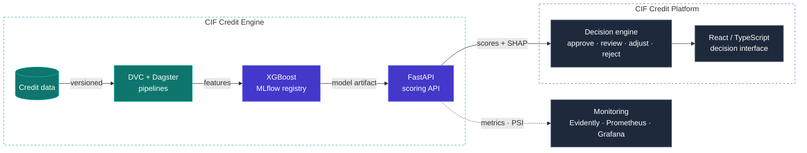

<a href="https://portefolio-ms.vercel.app">
<picture>
  <source media="(prefers-color-scheme: dark)" srcset="assets/banner-dark.svg"/>
  
</picture>
</a>

 

 

## 01 · Selected work

<table>
<tr>
<td width="44%" valign="top"></td>
<td valign="top">

### [CIF Credit Engine](https://github.com/Sow221/cif-credit-intelligencedescription)
<samp>credit-risk ML system · open source</samp>

Credit-risk engineering platform for microfinance — built as a **reproducible ML system**, not a notebook.

- Data pipelines versioned with **DVC**, orchestrated with **Dagster**
- **XGBoost** model tracked in **MLflow**, documented with model cards
- Validated on **real Lending Club data**, with a **24-month** monitoring replay
- **FastAPI** serving: JWT, Redis rate limiting, PostgreSQL audit trail
- Drift alerts with a from-scratch **PSI**, Evidently, Prometheus, Grafana
- **125 tests** · CI builds and Trivy-scans the Docker image

**[Code →](https://github.com/Sow221/cif-credit-intelligencedescription)** &nbsp; **[Live API docs →](https://cif-credit-intelligence.onrender.com/docs)**

</td>
</tr>
</table>

<table>
<tr>
<td width="44%" valign="top"></td>
<td valign="top">

### [CIF Credit Platform](https://github.com/Sow221/cif-credit-intelligence)
<samp>decision-support application</samp>

Turns risk scores into **explainable, auditable lending decisions** for credit officers.

- Four-way **decision engine**: approve · human review · adjust · reject
- **Cost-driven thresholds** balancing review capacity and error costs
- Per-client **SHAP** explanations exposed through the API
- **RBAC** with 5 roles, multi-tenant JWT, append-only audit log
- Backend: **124 tests · 84 % coverage**, mypy strict
- **React / TypeScript** UI: 26 Storybook stories, 6 Playwright e2e tests

**[Code →](https://github.com/Sow221/cif-credit-intelligence)**

</td>
</tr>
</table>

<table>
<tr>
<td width="44%" valign="top"></td>
<td valign="top">

### TontineSN
<samp>fintech web application</samp> &nbsp; 

Laravel application digitising **tontines** (rotating savings groups) for the Senegalese market.

- Contribution **cycles and draws**, member roles and administration
- **Mobile-money** payments (PayTech, QR codes), receipts, outbound webhooks
- **WhatsApp** notifications and member credit-scoring
- PHPUnit feature tests, **PHPStan** static analysis, CI

Code available on request.

</td>
</tr>
</table>

> [!NOTE]
> The live API runs on a free tier — the first request may take about a minute to wake it up.

## 02 · Architecture

How the two CIF repositories fit together:

## 03 · Tech stack

<table>
<tr><td><samp>languages</samp></td><td><picture><source media="(prefers-color-scheme: dark)" srcset="https://skillicons.dev/icons?i=py,ts,js,php,java&theme=dark&perline=8"/></picture></td></tr>
<tr><td><samp>backend · frontend</samp></td><td><picture><source media="(prefers-color-scheme: dark)" srcset="https://skillicons.dev/icons?i=fastapi,laravel,react,nextjs,vite,tailwind&theme=dark&perline=8"/></picture></td></tr>
<tr><td><samp>data · ml</samp></td><td><picture><source media="(prefers-color-scheme: dark)" srcset="https://skillicons.dev/icons?i=sklearn,tensorflow,postgres,mysql,redis&theme=dark&perline=8"/></picture> 

</td></tr>
<tr><td><samp>mlops · devops</samp></td><td><picture><source media="(prefers-color-scheme: dark)" srcset="https://skillicons.dev/icons?i=docker,githubactions,git,linux,prometheus,grafana&theme=dark&perline=8"/></picture> 

</td></tr>
</table>

## 04 · Information systems

<table>
<tr>
<td width="50%" valign="top">

**⚙️ Workflow modelling** 
Tontine cycles, credit decisions, human-review queues

</td>
<td width="50%" valign="top">

**🔍 Audit & traceability** 
Append-only audit logs, versioned data and models

</td>
</tr>
<tr>
<td valign="top">

**🔐 Access control** 
JWT, OTP, role-based permissions, multi-tenancy

</td>
<td valign="top">

**🔌 Integration** 
Mobile-money payments, messaging APIs, webhooks

</td>
</tr>
</table>

## 05 · Currently

<pre>
🔭 building   →  CIF: moving from synthetic to real-data validation
🌱 deepening  →  software architecture · ML engineering
💬 ask me     →  credit scoring · MLOps · Laravel · FastAPI
⚡ open to    →  internships · junior software / ML engineering roles
</pre>

 

Built with care in Dakar · <a href="https://portefolio-ms.vercel.app">portefolio-ms.vercel.app</a> · <a href="https://www.linkedin.com/in/ms-officiel">LinkedIn</a>

