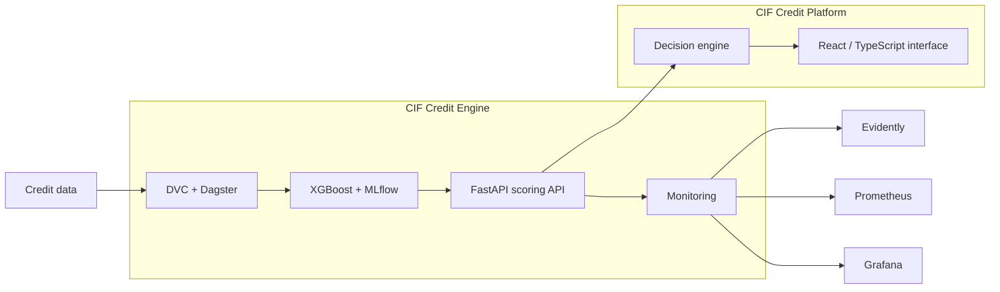

<a href="https://portefolio-ms.vercel.app">
  <picture>
    <source media="(prefers-color-scheme: dark)" srcset="https://raw.githubusercontent.com/Sow221/Sow221/main/assets/banner-dark.svg">
    <source media="(prefers-color-scheme: light)" srcset="https://raw.githubusercontent.com/Sow221/Sow221/main/assets/banner-light.svg">
    
  </picture>
</a>

  
  
  

  
  
  
  

Software engineer building digital systems across applications, data and AI.

---

## 01 · Selected work

### CIF Credit Engine

**Credit-risk engineering platform · Open source**

A credit-risk engineering system for microfinance, built as a **reproducible ML system rather than a notebook**.

| Area                                                                                                                           | Implementation                                                                       |
| ------------------------------------------------------------------------------------------------------------------------------ | ------------------------------------------------------------------------------------ |
|  Data & pipelines | DVC + Dagster                                                                        |
|  ML                    | XGBoost + MLflow + model tracking                                                    |
|  Validation         | Method validated on public Lending Club data with an out-of-time evaluation protocol |
|  API & security | FastAPI + JWT authentication + rate limiting                                         |
|  Persistence        | PostgreSQL + audit logging                                                           |
|  Monitoring            | PSI + Evidently + Prometheus + Grafana                                               |
|  Quality        | 107 automated tests · CI                                                             |

The current deployment uses a lightweight Render setup; Kubernetes/K3s and Terraform are documented as the scale-up path.

[Repository](https://github.com/Sow221/cif-credit-intelligencedescription) · [Live API](https://cif-credit-intelligence.onrender.com/docs)

> The live API runs on a free tier; the first request may take a moment to wake the service.

---

### CIF Credit Platform

**Decision-support application**

An application layer for explainable and auditable lending decisions.

| Area                                                                                                                          | Implementation                                                                            |
| ----------------------------------------------------------------------------------------------------------------------------- | ----------------------------------------------------------------------------------------- |
|  Decision engine | Four-way decision workflow: approval, human review, adjustment, refusal                   |
|  Risk modelling         | XGBoost probability of default + isotonic calibration                                     |
|  Explainability      | SHAP local and global explanations                                                        |
|  Decision policy       | Cost-driven thresholds and human-review capacity                                          |
|  Governance    | Temporal validation, bootstrap confidence intervals, segment analysis and fairness checks |
|  Traceability      | Model registry, experiment journal and audit-oriented architecture                        |
|  Reproducibility | DVC pipeline + automated tests + documented validation protocol                           |

The reported performance figures are experimental results on synthetic data; they are **not presented as CIF production performance**.

[Repository](https://github.com/Sow221/cif-credit-intelligence)

---

### TontineSN

**Private · Fintech application for Senegal**

A Laravel-based application designed around tontine operations and mobile-money workflows.

| Area                                                                                                                            | Implementation                                  |
| ------------------------------------------------------------------------------------------------------------------------------- | ----------------------------------------------- |
|  Operations          | Cycles, draws and member roles                  |
|  Payments                | Mobile-money payment workflows, QR and webhooks |
|  Messaging | WhatsApp notification workflows                 |
|  Data                   | Financial and credit-oriented data processing   |
|  Engineering     | PHPUnit · PHPStan · CI                          |

**Private repository — code available on request.**

---

  

## 02 · Architecture

  

## 03 · Tech stack

| Layer              | Technologies                                                                                                                                                                                                                                                                                                                                                                                                                                                                                                                                                    |
| ------------------ | --------------------------------------------------------------------------------------------------------------------------------------------------------------------------------------------------------------------------------------------------------------------------------------------------------------------------------------------------------------------------------------------------------------------------------------------------------------------------------------------------------------------------------------------------------------- |
| Languages          |  Python ·  TypeScript ·  JavaScript ·  PHP ·  Java                                                                                                                                  |
| Backend / frontend |  FastAPI ·  Laravel ·  React ·  Next.js ·  Vite ·  Tailwind                                              |
| Data / ML          |  scikit-learn ·  TensorFlow ·  PostgreSQL ·  MySQL ·  Redis · pandas · NumPy · XGBoost · SHAP                                                                         |
| MLOps / DevOps     |  Docker ·  GitHub Actions ·  Git ·  Linux ·  Prometheus ·  Grafana · MLflow · DVC · Dagster · pytest |

  

## 04 · Information systems

| Workflow modelling                                    | Audit & traceability                              |
| ----------------------------------------------------- | ------------------------------------------------- |
| Tontine cycles, credit decisions, human-review queues | Append-only audit logs, versioned data and models |

| Access control                                  | Integration                                     |
| ----------------------------------------------- | ----------------------------------------------- |
| JWT, OTP, role-based permissions, multi-tenancy | Mobile-money payments, messaging APIs, webhooks |

  

## 05 · Currently

|                                                                                                                                  |                                                      |
| -------------------------------------------------------------------------------------------------------------------------------- | ---------------------------------------------------- |
|  **Building**         | CIF: moving from synthetic to real-data validation   |
|  **Deepening**    | Software architecture · ML engineering               |
|  **Ask me** | Credit scoring · MLOps · Laravel · FastAPI           |
|  **Open to**         | Internships · junior software / ML engineering roles |

  

  <a href="https://portefolio-ms.vercel.app">Portfolio</a>
  &nbsp;·&nbsp;
  <a href="https://www.linkedin.com/in/ms-officiel/">LinkedIn</a>

