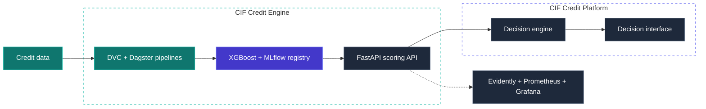

<a href="https://portefolio-ms.vercel.app">
<picture>
  <source media="(prefers-color-scheme: dark)" srcset="assets/banner-dark.svg"/>
  
</picture>
</a>

 

<h1>Software Engineering · Information Systems · Data &amp; AI</h1>

Software engineer building digital systems across applications, data and AI.

 

  

  

 

## 01 · Selected work

I build software systems where **applications, data, machine learning and operational workflows** meet — with an emphasis on reproducibility, traceability and integration.

<table>
<tr>
<td width="42%" valign="top">

</td>
<td width="4%"></td>
<td width="54%" valign="top">

### [CIF Credit Engine](https://github.com/Sow221/cif-credit-intelligencedescription)

<samp>credit-risk ML system · open source</samp>

Credit-risk engineering platform for microfinance — built as a **reproducible ML system**, not a notebook.

* Data pipelines versioned with **DVC**, orchestrated with **Dagster**
* **XGBoost** model tracked in **MLflow**, documented with model cards
* Method validated on **public Lending Club data** with an **out-of-time evaluation protocol**
* **FastAPI** serving: JWT, Redis rate limiting, PostgreSQL audit trail
* Drift alerts with a from-scratch **PSI**, Evidently, Prometheus, Grafana
* **107 tests** · 74 % coverage · CI with linting, type checking and Docker image scanning

 

  

 

</td>
</tr>

<tr><td colspan="3"> </td></tr>

<tr>
<td width="42%" valign="top">

</td>
<td width="4%"></td>
<td width="54%" valign="top">

### [CIF Credit Platform](https://github.com/Sow221/cif-credit-intelligence)

<samp>decision-support application</samp>

Turns risk scores into **explainable, auditable lending decisions** for credit officers.

* Four-way **decision engine**: approve · human review · adjust · reject
* **Cost-driven thresholds** balancing review capacity and error costs
* Per-client **SHAP** explanations exposed through the API
* **RBAC**, multi-tenant JWT and append-only audit trail
* Temporal validation, anti-leakage controls and segmented evaluation
* CI with **ruff, mypy, pytest and anti-leakage checks**

 

  

</td>
</tr>

<tr><td colspan="3"> </td></tr>

<tr>
<td width="42%" valign="top">

</td>
<td width="4%"></td>
<td width="54%" valign="top">

### TontineSN

<samp>fintech web application · private repository</samp>

Laravel application digitising **tontines** (rotating savings groups) for the Senegalese market.

* Contribution **cycles and draws**, member roles and administration
* **Mobile-money** payment integration, QR flows, receipts and outbound webhooks
* **WhatsApp** notifications and member credit-scoring
* PHPUnit feature tests, **PHPStan** static analysis, CI

 

  

Private work · code available on request.

</td>
</tr>
</table>

 

> [!NOTE]
> The live API runs on a free tier — the first request may take about a minute to wake it up.

 

## 02 · Architecture

The two CIF repositories form one engineering chain:

 

## 03 · Tech stack

The stack below reflects technologies used across my public work and broader software engineering practice — not a list of every technology I have ever touched.

<table>
<tr>
<td width="22%" valign="top"><strong>Languages</strong></td>
<td valign="top">

</td>
</tr>

<tr>
<td width="22%" valign="top"><strong>Backend · frontend</strong></td>
<td valign="top">

</td>
</tr>

<tr>
<td width="22%" valign="top"><strong>Data · ML</strong></td>
<td valign="top">

 

</td>
</tr>

<tr>
<td width="22%" valign="top"><strong>MLOps · DevOps</strong></td>
<td valign="top">

 

</td>
</tr>
</table>

 

## 04 · Information systems

My work focuses not only on individual applications or models, but on how **people, data, workflows and software systems interact**.

<table cellpadding="12">
<tr>
<td width="7%" align="center" valign="middle">

</td>
<td width="24%" valign="top"><strong>Workflow modelling</strong></td>
<td valign="top">Tontine cycles, credit decisions, human-review queues</td>
</tr>

<tr>
<td align="center" valign="middle">

</td>
<td valign="top"><strong>Audit &amp; traceability</strong></td>
<td valign="top">Append-only audit logs, versioned data and models</td>
</tr>

<tr>
<td align="center" valign="middle">

</td>
<td valign="top"><strong>Access control</strong></td>
<td valign="top">JWT, OTP, role-based permissions, multi-tenancy</td>
</tr>

<tr>
<td align="center" valign="middle">

</td>
<td valign="top"><strong>Integration</strong></td>
<td valign="top">Mobile-money payments, messaging APIs, webhooks</td>
</tr>
</table>

 

## 05 · Engineering interests

<table>
<tr>
<td width="25%" valign="top"><strong>Software architecture</strong></td>
<td valign="top">Designing maintainable systems across applications, APIs, data and infrastructure</td>
</tr>

<tr>
<td valign="top"><strong>ML engineering</strong></td>
<td valign="top">Reproducible pipelines, evaluation, serving, monitoring and model governance</td>
</tr>

<tr>
<td valign="top"><strong>Information systems</strong></td>
<td valign="top">Workflow modelling, integration, traceability, access control and digital transformation</td>
</tr>

<tr>
<td valign="top"><strong>Applied AI</strong></td>
<td valign="top">Using machine learning and AI where they create measurable value inside real software systems</td>
</tr>
</table>

 

## 06 · Currently

<table>
<tr>
<td width="7%" align="center" valign="middle">

</td>
<td valign="top"><strong>building</strong></td>
<td valign="top">CIF: moving from synthetic to real-data validation</td>
</tr>

<tr>
<td align="center" valign="middle">

</td>
<td valign="top"><strong>deepening</strong></td>
<td valign="top">software architecture · ML engineering</td>
</tr>

<tr>
<td align="center" valign="middle">

</td>
<td valign="top"><strong>ask me</strong></td>
<td valign="top">credit scoring · MLOps · Laravel · FastAPI</td>
</tr>

<tr>
<td align="center" valign="middle">

</td>
<td valign="top"><strong>open to</strong></td>
<td valign="top">internships · junior software / ML engineering roles</td>
</tr>
</table>

 

Built with care in Dakar · <a href="https://portefolio-ms.vercel.app">portfolio</a> · <a href="https://www.linkedin.com/in/ms-officiel">LinkedIn</a>

